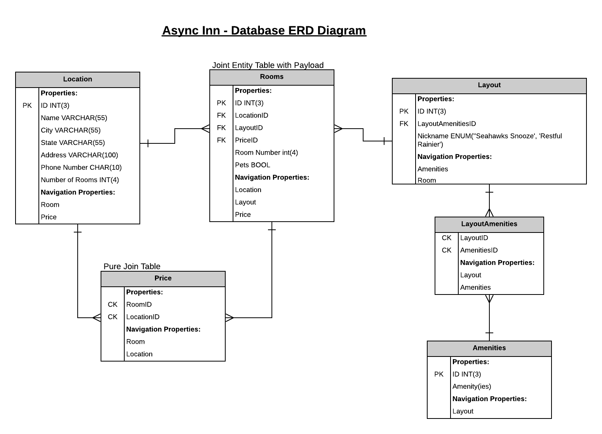

# Hotel Asset Management System

Created by: Peyton Cysewski, Na'ama Bar-Iln, Andrew Smith

## ERD

### Diagram Components:
##### Location Table
Key(s):  Primary Key  
Description: Each location has a name, city, state, address, phone number, and amount of rooms at the location.  
##### Layout Table
Key(s) - Primary Key, LayoutAmenitiesID(FK)  
Description:  
The Nickname property is an Enum, because it allows us to insert a list of predefined, unique values into the table. Duplicate values in the Enum list will cause an error.  
The Layout table has a 1:* relationship with the Rooms table, because many rooms in the hotel chain can have the same layout, but each room only has one layout.  
The Layout table has a 1:* relationship with the Amenities table because each layout can have multiple amenities.  
Navigation Properties - Amenities and Rooms.  
##### Rooms Table
Key(s): Primary Key, LocationID(FK), LayoutID(FK), PriceID(FK)  
Description: A room is dependent on its location, layout, and price. Each room also has a unique room number at each location, but locations will have repeat room numbers (ex. every hotel has a room 1).  
Joint Entity Table with Payload: The table has additional data (PK and pets property) on top of the composite keys.  
##### Amenities Table
Key(s): Primary Key  
Description: Amenities are combinatorial meaning that they can be related to another table individually or as a combination. Amenities are tied directly to the layout of a room which makes the layout table’s primary key a necessary part of the rooms table.  
##### Price Table
Key(s): RoomsID(CK), LocationID(CK)  
Description: Pricing is dependent on the location, room number, and layout (which is dependent on the amenities). This means that rooms will never share the same price in the same location, but a coincidental mixture of properties means that two prices could potentially be the same at different locations with other differing properties.  
Pure Join Table: The price table has no PK, the unique identifier is the combination of both Foreign Keys, Room ID and Location ID into Composite Keys.  
##### LayoutAmenities Table
Key(s): LayoutID(CK), AmenitiesID(CK)  
Description: The relationship between Amenities and Layout is a many to many, requiring a pure join. LayoutID is referencing the primary key from the Layout table, while AmenitiesID is referencing the primary key from the Amenities table.  
Pure Join Table: The LayoutAmenities table has no PK, the unique identifier is the combination of both Foreign Keys, LayoutID and AmenitiesID.  

## Change Log
1.1 *Initial Release* - 20 July 2020